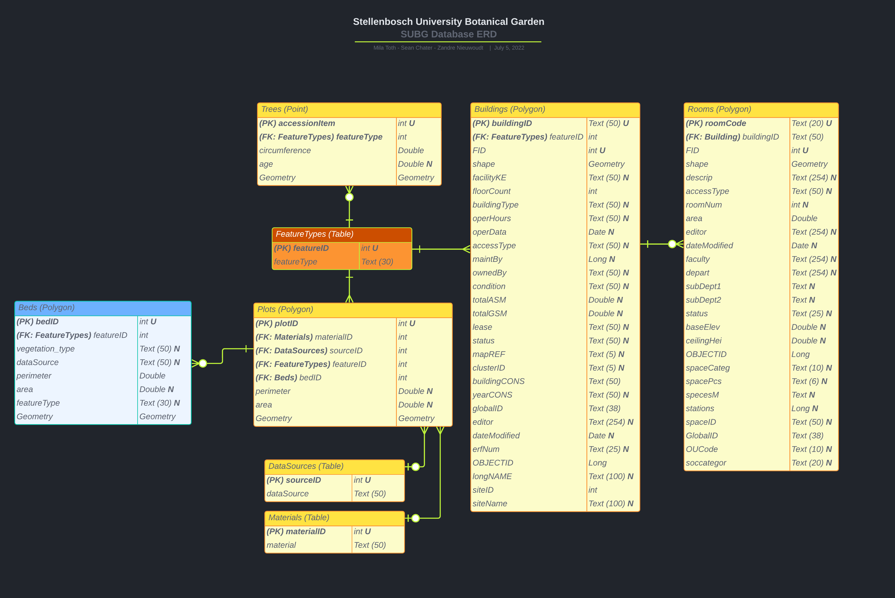
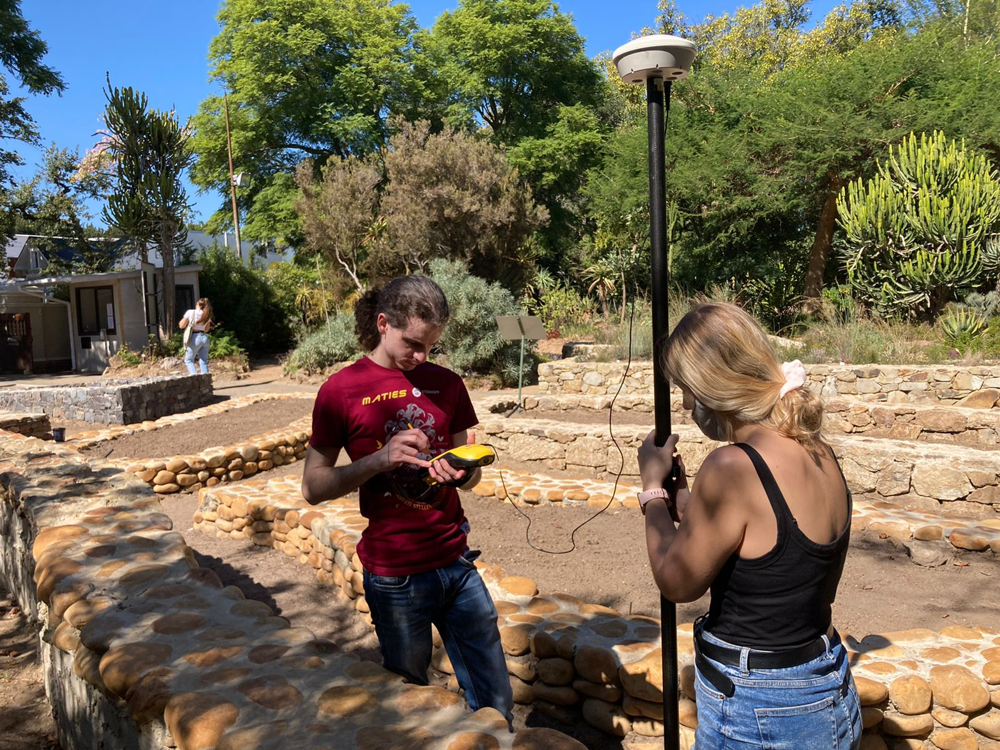
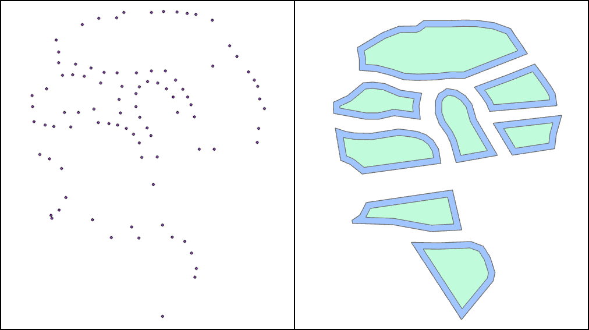
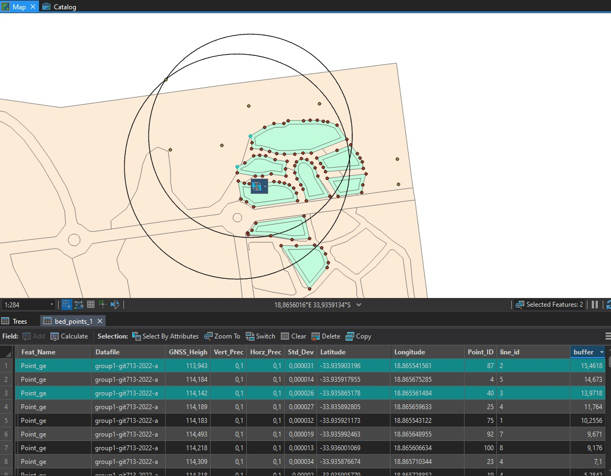
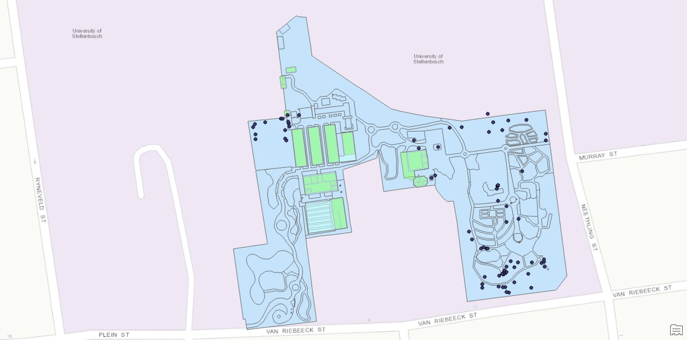
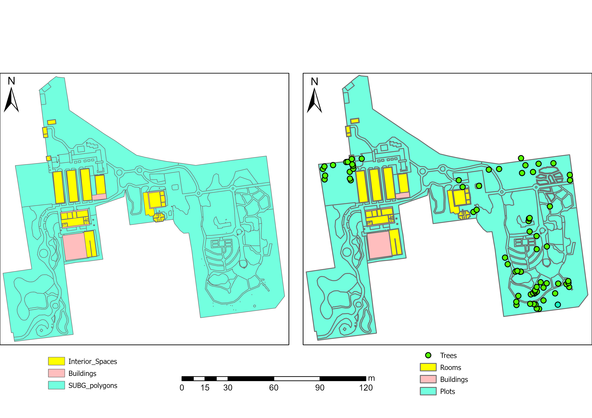

<style>#label {text-align: right}</style>
## Welcome to Zandré's Portfolio

> History teaches a working understanding of change.
-Arcadia Publishing

# Learning Experiences:

## Stellenbosch University Botanical Garden [Mapping new Beds]

### Project Management

.png)
<div id='label'><i>Gantt Chart</i></div>

\
One of the best ways to plan and manage your project is to set up a Gantt chart. During this process I learned the importance and value a simple chart can have to the progress of your project. An overview of our project Gantt chart can be seen above, and as is visually apparent, the tasks for your project tend to be more than you anticipate. 

For this reason I decided that an automated approach will be more suited for prolonged use, as we were planning to do for our project. To achieve this I decided to go with a macro enabled Excel Sheet and use Visual Basic (VBA) to implement automation. This was a completely new skill that I did not possess at the time and thus I ended up using and modifying an already existing VBA program. Looking back at how much time and effort the VBA enabled Excel Sheet saved me, I realized the importance of VBA and concluded that it is a skill I should learn as soon as possible.


### GIS Strategy & Implementation 


<div id='label'><i>Database ERD</i></div>

\
During GIS strategy our project objective required an Entity Relation Diagram (ERD) for a database design, as can be seen above. In this step I realized that I have gotten a bit rusty with the theory required. Other than that, it was apparent why we learned this specific piece of theory during undergraduate, and I can truly attest to the benefit of having this knowledge at the time. Even though I had no significant issues during the creation of our project ERD, it became apparent that this is a piece of knowledge that I might very be making use of more and more in the future. Having concluded that, I cannot confidently say that I’m where I would like to be regarding this specific skill and that I intend to work on it going forward.

Along with the ERD, our project participated in quite a few presentations in order to convey our progress to the client. Throughout my Honours degree so far, our entire class have been tasked to make more presentations than ever have before. Honestly speaking, I dreaded each and every single presentation, though the more I was exposed to presenting the more comfortable I became. I doubt that I’ll ever reach a point where I will enjoy presenting, but I can honestly say that being exposed truly helped me overcome my fear thereof. Here is one of the presentations I made to convey the ERD to the client with my team during this project: [Logical ERD Design](https://lucid.app/documents/view/fd13434c-3f37-4c64-9a2a-2ba3b8b976a1).

## Data Collection


<div id='label'><i>Data Caprute in Action</i></div>

\
Data collection was undertaken making use of a Differential Global Positioning System (DGPS). From past experiences and positive data management habits, data capture for this project went very smoothly. The only major hold was due to external factors and old equipment. The points were captured using the DGPS, and post processing was done using Trimble GPS Pathfinder. The processed captured points and the newly created features can be seen below.


<div id='label'><i>Captured Points & Created Features</i></div>

\
For this project it was required to capture a few trees as well. Due to inexperience and budget limitations this was a more complicated feat than first imagined. In the end I came up with the idea of using trigonometry and the already captured points to triangulate the location of the trees. A LASER distance measuring device was used in order to accomplish this task and the process itself worked out better than expected in the end. The issue we encountered was my lack of documentation on exactly which measurements were associated with which trees. In the end everything worked out and our tree captures can be seen below, but this was definitely a lesson learned in the importance of documenting data correctly and immediately after capture.


<div id='label'><i>Process Used to Map Tree Captures</i></div>


<div id='label'><i>Completed Geo-Database With Added Features</i></div>

### Geodatabase Delivered

One of the final steps in our project was to load all relevant data into our newly created geodatabase. For this task, a geodatabase was constructed following the logical model designed in one of the earlier steps. At the time of the logical schema, I was unaware of the limitations ArcGIS offers for their database design. Due to this, many intended functions were impractical and a true relation database could not be created. This lack of experience humbled me yet again, as I have come to feel quite knowledgeable regarding the workings of ArcGIS only to find that I indeed do not know as much as I thought I did.


<div id='label'>Original Database (Left) & New Database (Right)<i></i></div>

\
An overview showing the differences between the original and our newly created database can be seen in the image above.

### Software Development Management


<div id='label'><i></i></div>

\
This exercise handled one of the skills I was interested in learning though I never got around to it before. Teamwork is an unavoidable fact of working on large projects and having a good process to implement everyone's work together is important. GitHub is one way to implement this process and has become quite popular over the years. Having been given an exercise in which I got to learn the skills of working with GitHub gave me a good foundation to build upon going forward. The exercise was not able to touch upon every aspect, although it did cover the major aspects and workings. I believe that the skills I learned here might prove more beneficial one day than I can suspect right now. A good installation instruction for setting up an environment in order to use GitHub can be found [here](https://github.com/713-2022/installation/wiki).


```markdown
Syntax highlighted code block

# Header 1
## Header 2
### Header 3

- Bulleted
- List

1. Numbered
2. List

**Bold** and _Italic_ and `Code` text

[Link](url) and 
```

For more details see [Basic writing and formatting syntax](https://docs.github.com/en/github/writing-on-github/getting-started-with-writing-and-formatting-on-github/basic-writing-and-formatting-syntax).

### Jekyll Themes

Your Pages site will use the layout and styles from the Jekyll theme you have selected in your [repository settings](https://github.com/ZJnieuwoudt/ZJnieuwoudt.github.io/settings/pages). The name of this theme is saved in the Jekyll `_config.yml` configuration file.

### Support or Contact

Having trouble with Pages? Check out our [documentation](https://docs.github.com/categories/github-pages-basics/) or [contact support](https://support.github.com/contact) and we’ll help you sort it out.


<div id='label'><i></i></div>